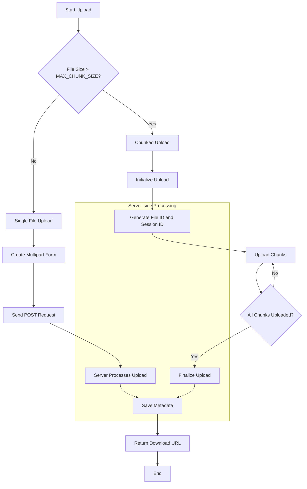

# TGPan Architecture and Data Processing Logic

## Overview

TGPan is a Cloudflare Workers-based file storage system that uses Telegram as a backend for file storage. This document outlines the architecture and data processing logic for key functionalities.

## Architecture

- **Runtime**: Cloudflare Workers
- **Framework**: Hono
- **Storage**:
  - KV Namespaces: USERS, FILES, FILE_DOWNLOAD_INFO, TASKS
  - Telegram: Actual file storage
- **Analytics**: Cloudflare Analytics Engine

## File Operations

TGPan uses Telegram as a storage provider, similar to how one might use S3. The file operations are abstracted in `src/utils/tgFileOps.ts`, which allows for potential future expansion to support additional storage layers.

Key operations include:
- `uploadToTelegramDocument`: Handles the upload of a file or chunk to Telegram.
- `uploadFile`: Manages the overall file upload process, including metadata creation.
- `fetchChunkUrlWithRetry`: Retrieves the URL for a specific chunk with retry logic.
- `preCacheChunkUrls`: Pre-caches URLs for all chunks of a file to improve download performance.

This abstraction allows for easier maintenance and potential integration of additional storage providers in the future.

## Data Processing Logic

### User Management

1. **User Structure**:
   ```typescript
   interface User {
     id: string
     token: string
     username: string
     enabled: boolean
   }
   ```

2. **User Creation**:
   - Generate a secure token and user ID
   - Save user data in KV namespace (USERS)
   - Store username-to-ID mapping for quick lookups

3. **Authentication**:
   - Use Bearer token in Authorization header
   - Validate token against stored user data

### File Upload

1. **Single File Upload**:
   - Generate a file ID
   - Upload file to Telegram using `uploadToTelegramDocument`
   - Create and save file metadata in KV namespace (FILES)
   - Return download URL to client

2. **Chunked Upload**:
   - Client splits file into chunks
   - For each chunk:
     - Upload to Telegram
     - Server returns chunk ID and file ID (for first chunk)
   - Client sends manifest with all chunk IDs
   - Server saves complete file metadata

3. **File Metadata Structure**:
   ```typescript
   interface FileMetadata {
     id: string;
     userId: string;
     filename: string;
     size: number;
     chunks: number;
     chunkIds: string[];
     expiresAt: string | null;
     fileType: string;
     uploadedAt: string;
   }
   ```

### Picture Upload (uploadPic)

1. Authenticate user with token query parameter
2. Validate file size against `PIC_MAX_SIZE` limit
3. Upload file to Telegram as a document
4. Save file metadata similar to regular file upload
5. Return download URL to client

### File Download

1. Retrieve file metadata using file ID
2. Set appropriate headers (Content-Type, Content-Disposition)
3. For each chunk:
   - Get chunk URL (from cache or Telegram API)
   - Fetch chunk data
   - Stream data to client
4. Log download analytics

## Caching Strategies

TGPan employs a multi-layered caching approach to optimize performance and reduce load on both the Cloudflare Workers and the Telegram API. This strategy involves three main components: KV storage, Cloudflare Edge Cache, and browser caching.

### 1. KV Storage Caching

- **Purpose**: Caches Telegram file URLs to reduce API calls.
- **Implementation**:
  - Uses the FILE_DOWNLOAD_INFO KV namespace.
  - Stores file chunk URLs with a configurable TTL (Time To Live).
  - Key format: `file:{fileId}:chunk:{chunkIndex}:url`
  - Value: JSON object containing the URL and expiration time.

- **Process**:
  1. Before requesting a file chunk URL from Telegram, check KV storage.
  2. If a valid (non-expired) URL exists, use it directly.
  3. If no valid URL exists, fetch from Telegram API and cache the result.

- **TTL Management**:
  - Configurable via `TG_FILE_URL_TTL` environment variable (default: 3600 seconds / 1 hour).
  - Implements a stale-while-revalidate strategy:
    - Use cached URL even if close to expiry.
    - Asynchronously refresh the URL in the background.

### 2. Cloudflare Edge Cache

- **Purpose**: Caches file content at Cloudflare's edge locations for faster delivery.
- **Implementation**:
  - Utilizes Cloudflare's built-in edge caching capabilities.
  - Controlled via Cache-Control headers in the response.

- **Strategy**:
  - For file downloads, set a long cache duration:
    ```typescript
    headers['Cache-Control'] = 'public, max-age=31536000'; // Cache for 1 year
    ```
  - This allows Cloudflare to cache the file content at edge locations.

- **Benefits**:
  - Reduces load on the Worker and Telegram servers.
  - Significantly improves download speeds for frequently accessed files.
  - Geographically distributed, reducing latency for global users.

### 3. Browser Caching

- **Purpose**: Enables client-side caching to reduce server load and improve user experience.
- **Implementation**:
  - Controlled by the same Cache-Control headers used for Edge caching.

- **Strategy**:
  - Long-lived cache for static files and downloaded content.
  - For dynamic content (e.g., user data), use appropriate cache headers to prevent stale data.

- **Considerations**:
  - Balance between freshness and performance.
  - Use versioning or fingerprinting for static assets to enable long-term caching while allowing updates.

### Caching Coordination

- **File Uploads**: 
  - No caching for upload requests to ensure data integrity.
  - Metadata is immediately stored in KV after successful upload.

- **File Downloads**:
  1. Check KV for cached chunk URLs.
  2. If not in KV, fetch from Telegram and cache in KV.
  3. Stream file content, which gets cached at Cloudflare's edge.
  4. Browser caches the file based on Cache-Control headers.

- **Cache Invalidation**:
  - For deleted or updated files, implement a mechanism to clear associated KV and edge cache entries.

### Performance Impact

- Reduced Telegram API calls: KV caching minimizes repeated requests for file URLs.
- Faster subsequent downloads: Edge and browser caching serve files without hitting the Worker or Telegram.
- Improved global performance: Cloudflare's distributed edge locations reduce latency for users worldwide.

By leveraging these caching mechanisms, TGPan achieves a balance between data freshness and system performance, ensuring efficient file storage and retrieval while minimizing unnecessary API calls and server load.

## Error Handling and Retries

- Implement retry logic for Telegram API calls
- Use exponential backoff for retries
- Log errors and write to analytics for monitoring

## Analytics

- Track key events: upload, download, errors
- Store raw data points for later processing with tools like Grafana

## Security Considerations

- Use secure tokens for user authentication
- Implement rate limiting (not shown in current code)
- Validate and sanitize all user inputs

## Scalability

- Cloudflare Workers provide automatic scaling
- Chunked uploads allow handling of large files
- KV namespaces offer low-latency, globally distributed storage for metadata

This architecture allows for a scalable, serverless file storage solution with Telegram as the backend storage provider.

## File Upload Process

The file upload process in TGPan is designed to handle both small and large files efficiently. It supports two main types of uploads: single file uploads and chunked uploads for larger files. Here's a detailed breakdown of the process:



### 1. Upload Initiation

When a user initiates an upload using the CLI tool:

1. The CLI determines whether to use single file upload or chunked upload based on the file size and the configured `MAX_CHUNK_SIZE`.
2. For image uploads, it also checks against the `MAX_IMAGE_SIZE` limit.

### 2. Single File Upload

For files smaller than or equal to `MAX_CHUNK_SIZE`:

1. The file is read into memory.
2. A multipart form is created with the file data.
3. The CLI sends a POST request to the server's upload endpoint (`/api/upload` for regular files, `/api/pic` for images).
4. The request includes:
   - The file data in the form
   - Authorization header with the user's token
   - Content-Type header set to the multipart form's content type
5. The server processes the upload:
   - Authenticates the user
   - Validates the file size and type
   - Uploads the file to Telegram using `uploadToTelegramDocument`
   - Creates and saves file metadata in the FILES KV namespace
6. The server responds with a success message and the file's download URL.

### 3. Chunked Upload

For files larger than `MAX_CHUNK_SIZE`:

#### a. Upload Initialization
1. The CLI sends an initialization request to the server with:
   - `isInit: true`
   - File metadata (name, size, total chunks, chunk size, file type)
2. The server processes this request:
   - Generates a unique file ID and session ID
   - Creates an initial file metadata entry in the FILES KV namespace
   - Responds with the file ID and session ID

#### b. Chunk Upload
For each chunk:
1. The CLI reads a chunk of the file (size determined by `MAX_CHUNK_SIZE`).
2. It creates a multipart form with:
   - The chunk data
   - Chunk metadata (chunk index, total chunks, file ID, session ID)
3. Sends a POST request to the `/api/upload` endpoint with this data.
4. The server processes each chunk:
   - Uploads the chunk to Telegram using `uploadToTelegramDocument`
   - Updates the file metadata with the new chunk information
   - Responds with a success message for the chunk

#### c. Upload Completion
1. After all chunks are uploaded, the CLI considers the upload complete.
2. The server finalizes the file metadata, marking the file as fully uploaded.

### 4. Image Upload from Clipboard

For image uploads directly from the clipboard:

1. The CLI reads the clipboard content.
2. If image data is found, it determines the MIME type.
3. The image data is sent to the server's `/api/pic` endpoint.
4. The server processes this similarly to a single file upload but with additional image-specific validations.

### 5. Error Handling and Retries

- The CLI implements error handling for network issues, server errors, etc.
- For chunked uploads, if a chunk upload fails, the CLI can retry that specific chunk.
- The server implements retry logic for Telegram API calls with exponential backoff.

### 6. Post-Upload Processing

After a successful upload:
1. The server ensures all file metadata is correctly stored in the KV namespace.
2. For chunked files, it verifies that all chunks are present and the file is complete.
3. It generates and returns a download URL to the client.

### 7. Security Considerations

- All requests are authenticated using the user's token.
- File size limits are enforced to prevent abuse.
- MIME type detection is performed to ensure only allowed file types are uploaded.

This upload process ensures efficient handling of both small and large files, provides robust error handling, and maintains security throughout the upload operation.