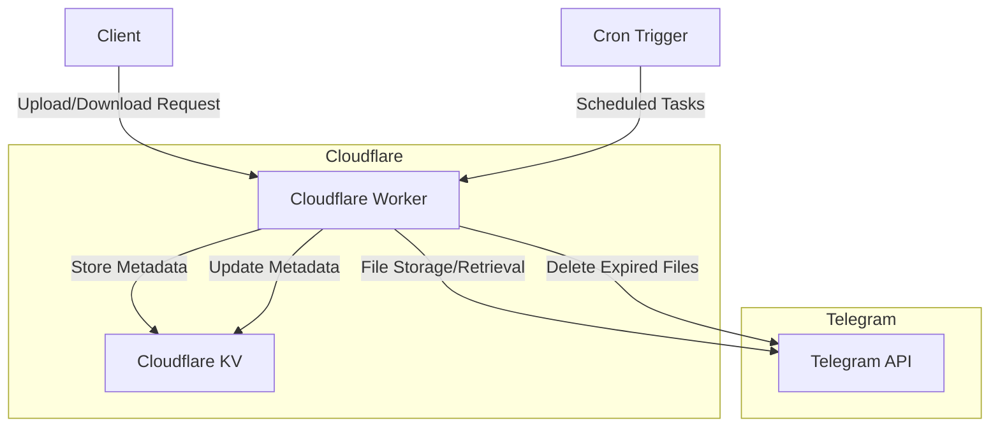

# tgpan: Serverless Telegram-based File Storage System

## Concept
Inspired by the project tgstate written in golang, now I make it serverless and manageable for small team as casual external file storage.

tgpan is a serverless file storage system that leverages Telegram's infrastructure for storing files. It provides a simple API for uploading and downloading files, with the actual file data being stored in Telegram channels or groups. This approach allows for virtually unlimited, free file storage with the reliability of Telegram's infrastructure. The serverless part relies on fantastic Cloudflare Workers, and it is designed to be fully working with Workers Free plan but recommended to use with Paid plan for better performance and reliability.

## Architecture

tgpan is implemented as a Cloudflare Worker, providing a serverless, globally distributed file storage solution. Here's an overview of the system architecture:



### Components:

1. **Cloudflare Worker**: Handles API requests, file processing, and communication with Telegram.
2. **Cloudflare KV**: Stores file metadata and task information.
3. **Telegram API**: Used for actual file storage and retrieval.
4. **Cron Trigger**: Schedules regular tasks like deleting expired files.

## Implementation Details

### File Upload Process:

1. Client sends a file upload request to the Worker.
2. Worker checks file size:
   - If file size <= CHUNK_SIZE, upload as a single file.
   - If file size > CHUNK_SIZE, split into chunks and upload each chunk separately.
3. For chunked files, create a manifest file with chunk information.
4. Store file metadata in Cloudflare KV.
5. Return file ID and download URL to the client.

### File Download Process:

1. Client requests a file download using the file ID.
2. Worker retrieves file metadata from KV.
3. If the file is not chunked, stream the file directly from Telegram.
4. If the file is chunked, retrieve and combine all chunks before streaming to the client.

### Expiry Management:

- A daily cron job checks for expired files.
- Expired files are deleted from both Telegram and KV storage.

## Usage Instructions

### Prerequisites:

1. Cloudflare Workers account
2. Telegram Bot Token
3. Telegram Channel or Group ID

### Setup:

1. Clone the repository:
   ```
   git clone https://github.com/yourusername/tgpan.git
   cd tgpan
   ```

2. Install dependencies:
   ```
   npm install
   ```

3. Configure `wrangler.toml`:
   - Set your `BOT_TOKEN` and `CHANNEL_ID`
   - Configure KV namespace IDs

4. Deploy the worker:
   ```
   wrangler publish
   ```

### API Usage:

#### Upload a File:
POST /api/upload
Content-Type: multipart/form-data

Form Data:
- file: (binary)

Response:
{
  "fileId": "unique_file_id",
  "downloadUrl": "/d/unique_file_id"
}

#### Download a File:
GET /d/:fileId

## Configuration Options

- `CHUNK_SIZE`: Maximum size of a single file chunk (default: 10MB)
- `FILE_EXPIRY`: Time until a file expires (default: 7 days)

These can be adjusted in the `wrangler.toml` file.

## Limitations and Considerations

- Maximum file size is limited by Telegram's restrictions (currently 2GB per file).
- File storage duration is subject to Telegram's data retention policies.
- Ensure compliance with Telegram's terms of service when using this system.

## Contributing

Contributions are welcome! Please follow these steps:

1. Fork the repository
2. Create a new branch for your feature
3. Make your changes
4. Write or update tests as necessary
5. Run the test suite
6. Submit a pull request

Please ensure your code adheres to the existing style and passes all tests before submitting a pull request.

## License

This project is licensed under the MIT License. See the LICENSE file for details.
