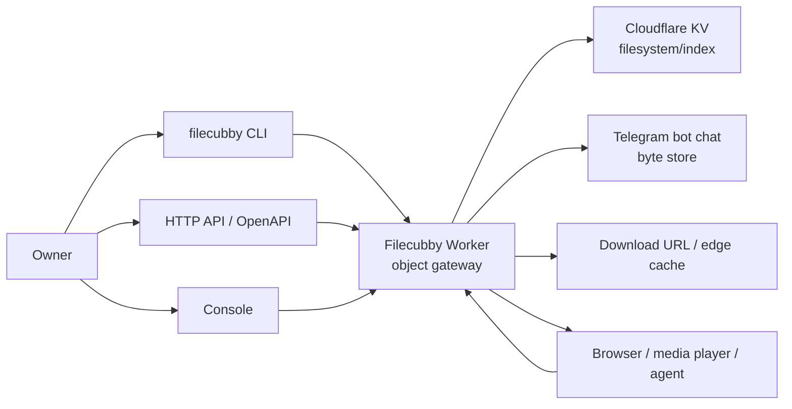

# Architecture

Filecubby is owner-operated, serverless personal object storage. Telegram stores
object bytes, Cloudflare KV stores the filesystem/index, and the Cloudflare
Worker is the object gateway.

## Runtime

- Worker: `src/index.ts`
- Framework: Hono on Cloudflare Workers
- Package manager: `pnpm`
- Deploy tool: project-local Wrangler
- Node: 22 LTS
- Worker name: `filecubby`
- Custom domain: use a hostname on the operator's own Cloudflare-managed zone
- Analytics dataset: `filecubby_analytics`

## System Map



## Terms

- Owner: the person who owns the Cloudflare account, Telegram account, bot,
  storage chat, and service tokens.
- System: one Filecubby deployment operated by that owner.
- Namespace: an object namespace owned by the system. Version 1 uses `default`.
- Collection: a named grouping under namespace `default`.
- Object: one logical stored item with a unique id.
- Chunk: one Telegram document that stores part or all of an object.
- Byte store: Telegram Bot API documents in the owner-controlled storage chat.
- Filesystem/index: Cloudflare KV records that make objects searchable and
  downloadable.
- Recovery record: optional Telegram caption or manifest text that can rebuild
  missing KV metadata when still visible through Bot API updates.

## Storage Model

```text
owner
  system: filecubby
    namespace: default
      collections
        collection:default:<collectionId>
        collection-slug:default:<slug>
      objects
        object:default:<objectId>
          metadata
          chunks[]
```

Cloudflare KV bindings:

- `FILES`: canonical object metadata, collection metadata, and collection slug
  indexes.
- `USERS`: named service-token metadata and token indexes.
- `FILE_DOWNLOAD_INFO`: Telegram chunk URL cache and download helper metadata.
- `TASKS`: task namespace retained for scheduled/background workflows.

`FILES` is the source of truth for object organization. Telegram `file_id`
values are stored as chunk ids; the Worker resolves those ids to Telegram file
URLs when serving downloads.

## Auth Model

Filecubby is intentionally single-tenant:

- One Telegram bot/chat stores all object chunks.
- `ADMIN_TOKEN` protects token-management APIs.
- Named service tokens can upload, list, patch, delete, and download from the
  same storage tenant.
- Collections and paths are organization primitives, not access-control
  boundaries.
- There is no RBAC.

Service-token storage uses:

- `service-token:<id>` -> token metadata
- `service-token-name:<name>` -> token id
- `token:<sha256(token)>` -> token id

The plaintext token value is returned only by `POST /api/tokens`.

## Object Metadata

```ts
interface ObjectMetadata {
  namespaceId: "default"
  id: string
  userId: string
  name: string
  size: number
  chunks: number
  chunkSize?: number
  chunkIds: string[]
  chunkMessageIds?: Array<number | null>
  manifestMessageId?: number
  expiresAt: string | null
  type: string
  uploadedAt: string
  updatedAt?: string
  path?: string
  tags?: string[]
  collectionIds?: string[]
  description?: string
  backend?: "telegram-bot-api"
  createdByTokenId?: string
}
```

`chunkSize` lets ranged media streaming map byte offsets to Telegram chunks.
`path`, `tags`, and `collectionIds` are lightweight organization fields.

Collection metadata is similarly small:

```ts
interface Collection {
  namespaceId: "default"
  id: string
  name: string
  slug: string
  description?: string
  path?: string
  tags?: string[]
  createdAt: string
  updatedAt: string
}
```

## Request Surface

Public routes:

- `GET /test`
- `GET /openapi.json`
- `GET /console`
- `GET /d/:objectId`
- `HEAD /d/:objectId`
- `GET /d/:objectId/partial`
- `POST /api/upload/image`

Service-token routes:

- `POST /api/upload`
- `POST /api/upload/finalize/:objectId`
- `GET /api/upload/status/:objectId`
- `GET /api/objects`
- `GET /api/objects/:id`
- `PATCH /api/objects/:id`
- `GET /api/collections`
- `POST /api/collections`
- `GET /api/collections/:id`
- `PATCH /api/collections/:id`
- `DELETE /api/collections/:id`
- `POST /api/repair/import-telegram`
- `POST /api/del`

Admin-token routes:

- `GET /api/tokens`
- `POST /api/tokens`
- `PATCH /api/tokens/:id`
- `DELETE /api/tokens/:id`
- `POST /api/cache/clear`
- `GET /api/cache/status`

## Upload Flow

Small uploads go through `POST /api/upload` as multipart form data. Object
metadata fields use object terminology:

- `objectName`
- `objectType`
- `objectSize`
- optional organization fields: `path`, `tags`, `collectionIds`, `description`

Chunked uploads use the same endpoint:

- initialize with metadata-only `POST /api/upload`
- upload chunks with `isChunk=true`, `chunkIndex`, `totalChunks`, `objectId`,
  `objectName`, `objectType`, `chunkSize`, and binary field `file`
- optionally call `POST /api/upload/finalize/:objectId`

Responses return `objectId` and, when complete, `/d/<objectId>`.

## Download Flow

Downloads are unlisted bearer-style object URLs:

- `HEAD /d/:objectId`
- `GET /d/:objectId`
- `GET /d/:objectId?dl=1` to force attachment behavior

The Worker loads metadata from `FILES`, resolves Telegram chunk URLs through
`FILE_DOWNLOAD_INFO`, and streams bytes to the client. It sets
`Accept-Ranges: bytes`; `Range` requests return `206 Partial Content` with a
precise `Content-Range` and only fetch the required chunks.

Inline display is allowed for common media and document types, including MP4,
WebM, MP3/MPEG audio, images, JSON, PDF, and text.

## Telegram Recovery Records

`TELEGRAM_ORGANIZATION_MODE` controls whether uploads write organization hints
into Telegram:

- `off`: organization stays only in Cloudflare KV.
- `caption`: object chunks get short, marker-prefixed captions.
- `manifest`: Filecubby sends one marker-prefixed recovery manifest message
  after the object chunks have been uploaded.

`FILECUBBY_MARKER` defaults to `fc`. Captions and manifests include
`namespace: default` when needed for repair/import.

Repair/import uses `getUpdates` through `POST /api/repair/import-telegram`.
That can reconstruct KV records only from messages the Bot API can currently
see; it does not read arbitrary old chat history.

## Caching

The active performance path has two layers:

- Telegram chunk URL caching in `FILE_DOWNLOAD_INFO`.
- Optional chunk-body caching through the Cloudflare Cache API.

`CACHE_CHUNK_EDGE_ON_UPLOAD` defaults to false, so upload completion does not
block on edge chunk-body caching. Downloads can still cache fetched chunks.

## CLI

The Go CLI is in `cli/` and installs as `filecubby` with `just install`.

Config resolution:

- `--config <path>` if passed
- `$XDG_CONFIG_HOME/filecubby/config.yml`
- `~/.config/filecubby/config.yml`
- env overrides such as `FILECUBBY_TOKEN`, `FILECUBBY_BASE_URL`,
  `FILECUBBY_API_BASE_URL`, and `FILECUBBY_URL`

Clipboard image upload first uses `github.com/aymanbagabas/go-nativeclipboard`.
On macOS, it falls back to `osascript` when the native clipboard backend cannot
return image bytes.
